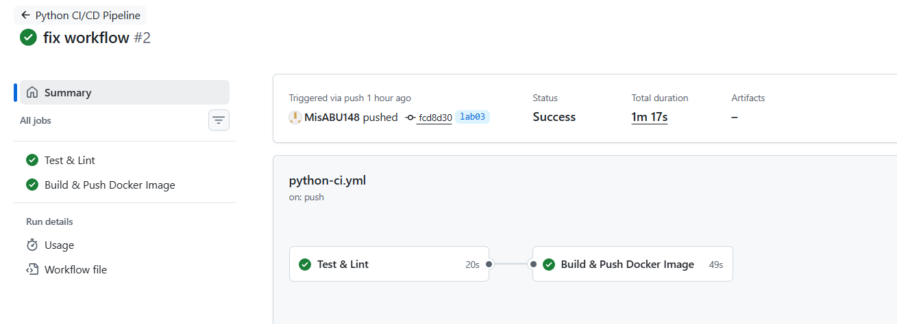

# Lab 3: Unit Testing for FastAPI Application
## Testing Framework Selection

1. Chosen Framework: pytest
Justification:
- pytest was selected over unittest due to:
- Minimal boilerplate (simple assert statements)
- Native support for fixtures and dependency injection
- Excellent integration with FastAPI via TestClient
- Powerful ecosystem (pytest-cov, monkeypatch, parametrization)
- Industry-standard for modern Python projects

This aligns with production-grade testing practices and CI/CD pipelines.

2. Test Structure
```bash
app_python/
└── tests/
    ├── conftest.py         # Shared test fixtures
    ├── test_root.py       # Tests for GET /
    ├── test_health.py     # Tests for GET /health
    └── test_errors.py     # Error handling tests (404, 500)
```
- conftest.py defines a reusable FastAPI TestClient fixture.
- Each endpoint has a dedicated test file for isolation and clarity.
- Tests validate both successful responses and error cases.

3. Tested Endpoints & Coverage
### GET /

Validated:
- HTTP status code = 200
- Presence of required top-level fields:
    - service, system, runtime, request, endpoints
- Correct service metadata values
- System info field types (hostname, platform, cpu_count, etc.)
- Runtime timestamps format and timezone
- Request metadata (method, path, user-agent, client_ip)
- Endpoints list structure

### GET /health

Validated:
- HTTP status code = 200
- Health status = "healthy"
- Timestamp format (UTC, ISO8601)
- Service name and version correctness
- Uptime field presence and type
### Error Handling
- 404 Not Found:
  - Custom error response structure
  - Correct path returned
- 500 Internal Server Error:
  - Simulated failure via monkeypatch
  - Verified error response and HTTPException behavior


4. How to Run Tests Locally
Install dependencies:
```bash
pip install -r requirements-dev.txt
```

Run all tests:
```bash
pytest -v
```

Run with coverage:
```bash
pytest --cov=app --cov-report=term-missing
```

Run a single test file:
```bash
pytest tests/test_root.py -v
```

Terminal Output (All Tests Passing)
test_root.py:
```bash
tests/test_root.py::test_root_status_code PASSED
tests/test_root.py::test_root_json_structure PASSED
tests/test_root.py::test_root_service_fields PASSED
tests/test_root.py::test_root_system_fields PASSED
tests/test_root.py::test_root_runtime_fields PASSED
tests/test_root.py::test_root_request_metadata PASSED
tests/test_root.py::test_root_endpoints_list PASSED

test_health.py:
tests/test_health.py::test_health_status_code PASSED
tests/test_health.py::test_health_response_structure PASSED

test_errors.py:
tests/test_errors.py::test_internal_server_error PASSED
tests/test_errors.py::test_404_handler PASSED

Final Summary:
============================== 11 passed in 0.17s ==============================
```

## Workflow Trigger Strategy

### Configured Triggers:
```yaml
on:
  push:
    branches: [ main, master, lab*, develop ]  # Code changes
    tags: [ 'v*' ]                             # Version releases
  pull_request:
    branches: [ main, master ]                 # PR validation
  workflow_dispatch:                           # Manual trigger
```

### Reasoning:
- Push to branches: Every code change is tested immediately
- Pull requests: Ensures PRs don't break existing functionality
- Version tags: Automatically releases when you create git tags
- Workflow dispatch: Allows manual runs for testing/debugging

This strategy ensures no broken code ever reaches production while automating releases when you're ready.

Why I Chose Specific GitHub Actions

| Action                        | 	Purpose             | 	Why This One?                   |
|-------------------------------|----------------------|----------------------------------|
| actions/checkout@v4           | 	Clone repository    | 	Official, fast, supports tags   |
| actions/setup-python@v5       | 	Python environment	 | Caching, version matrix, official |
| docker/login-action@v3        | 	Docker Hub auth	    | Secure token handling, official  |
| docker/setup-buildx-action@v3 | 	Docker BuildKit     |	Multi-platform builds, caching   |
| docker/build-push-action@v5   | 	Build & push        |Multi-tag support, layer caching|

### Docker Tagging Strategy
Based on Semantic Versioning (SemVer):

Tags Generated:

| Tag Format | 	Example |	When| 	Purpose                       |
|------------|----------|--------------|--------------------------------|
| v1.2.3     | 	v1.0.0  |	Git tag push	| Exact release - reproducible   |
| v1	        | v1	      |On release| 	Major version - latest v1.x   |
| v1.2       | 	v1.0    |	On release| 	Minor version - latest v1.2.x |
| latest	    | latest   | 	Every build	 | Latest stable - quick pull     |
|2026.02.12|	2026.02.12|	Main branch| 	Calendar version - fallback   |

Why This Strategy:
- Traceability: v1.2.3 matches git tag → knows exact code
- Flexibility: Users can pin to major (v1), minor (v1.2), or exact (v1.2.3)
- Convention: Follows Docker Hub best practices
- Automation: CI generates tags automatically based on git events


## Successful Workflow Run

### GitHub Actions Dashboard:


*All jobs passed: test (11 tests) and docker (5 tags pushed)*

### Workflow Details:
- **Run ID:** 21954210464
- **Commit:** a78b61a "fix workflow"
- **Branch:** lab03
- **Trigger:** push
- **Duration:** 1m 34s

**Direct link:** https://github.com/MisABU148/DevOps-Core-Course/actions/runs/21954210464]

